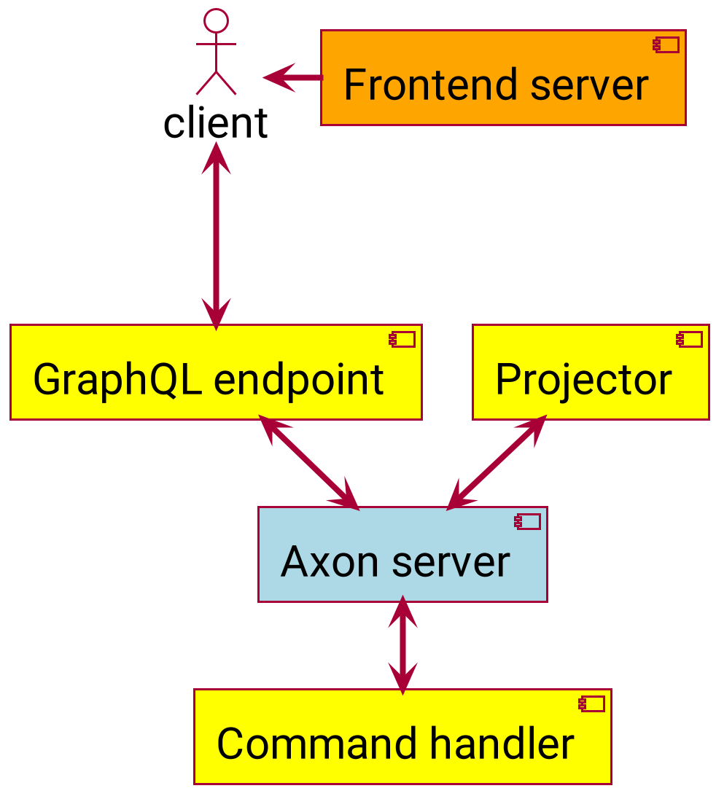

# Bank Axon Graphql

## Quickstart

If you already have Maven, Java and Docker locally available, running `./prepare.sh && ./restart.sh` in the root folder
should build and start all. Once done the [frontend is available at port 8181](http://localhost:8181/)
, [axon server at port 8024](http://localhost:8024/) and [Graph*I*QL at 8888/graphiql](http://localhost:8888/graphiql).

## Intro

This project is all about experimenting with the [Axon Framework](https://axoniq.io/product-overview/axon-framework),
rebuilding the CQRS bank application I build earlier, mostly using Kafka. I used a similar setup before, but using
mostly PostgreSQL and Kafka to handle the commands and events, and have queries directly against the aggregate stored in
PostgreSQL.

There are several versions of the former project
available, [kafka-graphql-examples](https://github.com/openweb-nl/kafka-graphql-examples), contains several
implementations of the GraphQL backend in different languages.
Also, [obm_confluent_blog](https://github.com/gklijs/obm_confluent_blog), which has several implementations of the
command handler, and also has a related [blog post](https://www.confluent.io/blog/getting-started-with-rust-and-kafka).

## Summary

This project is using Axon server as the central component to route the different kind of messages. The 'backend' part
consists of both the command handler and the projector which precess the commands and related events. The 'frontend'
part consists of the GraphQL endpoint that is creating commands based on the interaction from the frontend, and is also
used to transfer the events and queries down to the frontend.

There are also two kinds of subscriptions used. One for all the transactions, that is shared within the endpoint, and
specific subscriptions for handling the success or failure of transfers, creating a subscription for the specific
transfer id. The several components are on purpose loosely coupled without a common parent. They do share the core-api
dependency.

Contents

* [Development](#development)
    * [Building locally](#building-locally)
* [Modules](#modules)
    * [Core api](#core-api)
    * [Initializer](#initializer)
    * [Command handler](#command-handler)
    * [Graphql endpoint](#graphql-endpoint)
    * [Frontend](#frontend)
* [Scripts](#scripts)

## <a id="development">Development</a>

Since the components are closely related, it's easiest to run all with docker and disable the component you want to work
on. You don't need a specific profile, as from docker axon is available on the default localhost port.

### <a id="building-locally">Building locally</a>

You should have maven and java installed locally. Use `./prepare.sh && ./restart.sh` to start all the components
locally. This will de 'everything', including building and locally installing the core-api. All the components are
named, so you can use something like, `docker stop command-handler` to stop specific parts.

## <a id="modules">Modules</a>

The modules are describe in order of data flow. The first, topology will be used to generate the data types, the last
but one, frontend will expose the data to make it visible.

### <a id="core-api">Core api</a>

This module contains all the definitions for the messages for the bank and the user domain. There are also some util
methods to handle ibans and tokens.

### <a id="initializer">Initializer</a>

This module just created the company bank account with some initial funds. This serves a couple of uses. It makes sure
the frontend is only started ones the backend is fully operational. The subscription for the transactions can't handle a
null from the repository, so this makes sure there is one transaction available. The frontend by default opens with a
query on the company account, so if it doesn't exist it will give an error.

### <a id="command-handler">Command handler</a>

This module will hande the commands. It includes saga to handle the transfer of money. It is based on the past rules. So
for example you can transfer money to almost any account. When it's not an 'axon' account the money will just '
vanish'. When it's an 'axon' account it will try to debit the money to that account. In case of failure the money is
refunded.

### <a id="graphql-endpoint">Graphql endpoint</a>

This endpoint is based on the schema which was used [before](graphql-endpoint/src/main/resources/bank.graphql). The
complex ones are for creating the account, and transferring money. Most other ones are simple queries, that use the
query bus to get the result from the projector, and simply it in the graphql api format.

To create an account it's checked the username doesn't exist yet, if it does the password is checked. After the account
is created the bank account is also directly created. It's possible to expand functionality by adding creating or
removing bank accounts to the schema. For the money transfer a subscription is used to get the result.

### <a id="frontend">Front-end</a>

This is a basic nginx container which contains the output from the Clojurescript re-frame code. The container is exposed
at port 8181. The location of the GraphQL endpoint is configured
in [core.cljs](frontend/src/cljs/tech/gklijs/bank/core.cljs) this is configured to use localhost. Nginx now just serves
static files, but could be used to proxy traffic to the graphql endpoint to prevent CORS.

To focus on the backend part, the frontend is currently not rebuild with the `prepare.sh` script. You can use
the [build-and-copy-frontend.sh](frontend/build-and-copy-frontend.sh) script to rebuild. But you need leiningen and
saasc installed to do so.

## <a id="scripts">Scripts</a>

There are several scripts to automate things. They are placed at the root level.

* `clean.sh` stops and removes all used Docker container, it does not throw away the images
* `prepare.sh` is needed the first time before `restart.sh` can be used. It will get all the dependencies and build
  jar's. It needs maven to be installed. As last step it will (re)build the docker images.
* `restart.sh` is used to stop and start the whole setup. When it's finished the application should be accessible at
  port 8181.
* `initialize.sh` is used as part of the restart to set the company account if it doesn't exist yet, and makes sure the
  backend is properly initialized.
